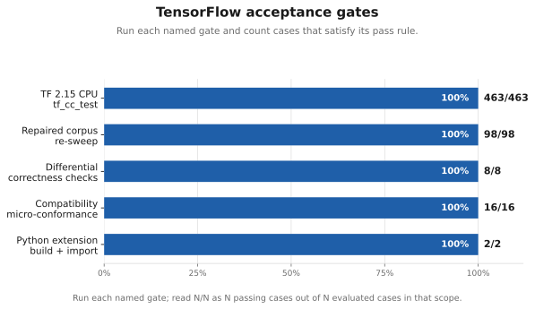
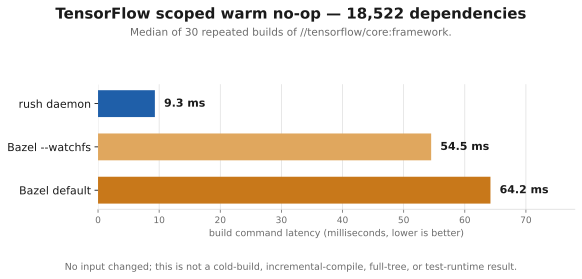

# Rush build status

Rush is an independent build engine for Bazel projects, written in Rust.
No JVM, no Bazel code. It consumes unmodified Bazel trees — BUILD files,
`.bzl` macros, Bzlmod module graphs, toolchains — and executes them with
Bazel-parity semantics: same artifacts, same select() behavior, same test
outcomes. The bar we hold ourselves to is byte parity: where we claim
support, rush's outputs hash-match Bazel's.

This repository tracks public progress and statistics for the project.
**The rush source is not yet public.** Main is hosted privately while we
prepare the open-source release. We are looking for interested parties to
collaborate — build-system engineers, and maintainers of large Bazel codebases
who want a fast second implementation or a conformance probe for their rule
stacks. Open an issue here or contact Luis Chamberlain
<mcgrof@do-not-panic.com>.

## Headline results

| Workload | Result |
|----------|--------|
| TensorFlow 2.15 (unmodified) | Builds; **463/463** CPU `tf_cc_test` targets pass |
| `libtensorflow_cc.so` | Links, dlopen-loadable (`RTLD_NOW`), runs real workloads |
| TensorFlow GPU (ROCm, TF 2.17) | GPU `tf_cc_test` builds and passes on an AMD Radeon Pro W7900 |
| Modular whole-repo (pin 2026-07-30) | **4,175 of 4,175 (100%)** Bazel-buildable targets build under rush, incl. 1,063 real Python builds; 38/39 comparable `.mojoc` artifacts byte-identical |
| Modular pip lock pipeline | `uv lock` + wheel install + hermetic py_binary generator: output **byte-identical** to the checked-in 32,586-line lock file |
| Modular stdlib (pin 2026-08-04) | `std.mojoc` **byte-identical** to Bazel; 335/335 test targets build; **264 tests verified green** |
| Modular GPU (H100) | tiled_matmul builds, runs, validates; output byte-identical to Bazel over 10 alternating runs |
| Warm no-op, 335-target corpus | rush **0.02 s** vs Bazel 0.33 s |
| TensorFlow-scale warm no-op, 18,522-dep manifest | rush **9.3 ms p50** vs Bazel 64.2 ms (54.5 ms with `--watchfs`) |
| Single-file incremental, 335-target stdlib-test closure | rush **2.0 s** vs Bazel 4.7 s (small closure; see benchmarks.md for the whole-repo case, where Bazel's early cutoff currently wins) |

Honesty notes: the TensorFlow no-op result is a median-of-30 measurement for
`//tensorflow/core:framework`, not a whole-tree timing claim. Detailed gap
lists live in the status pages — we publish what does not work yet with the
same care as what does.

## TensorFlow certification at a glance — run these gates

A certificate is the recorded result of one named acceptance gate: its exact
case list, procedure, pass rule, and passing count. Run the named procedure,
apply its pass rule, and publish **N/N** only when every case in that exact
scope passes. The CPU corpus gate builds and executes 463 non-GPU `tf_cc_test`
programs; the other rows specify build, differential, conformance, or
import-smoke evidence. Follow the complete procedures, GPU lane,
corpus-repair record, and open work on the
[TensorFlow status page](status/tensorflow.md).

## TensorFlow build performance

The current published head-to-head TensorFlow timing is deliberately narrow:
30 warm no-op builds of `//tensorflow/core:framework`, whose retained manifest
contains 18,522 dependencies. Rush completes in **9.3 ms p50**, versus Bazel
**64.2 ms** by default and **54.5 ms** with `--watchfs` (6.9x and 5.9x faster,
respectively). No input changed; this measures build-command latency, not a
cold build, incremental compile, full-tree build, or test runtime. Those TF
comparisons will be added only after matching-scope measurements are complete.

## Modular build performance

The timing charts below are **Modular measurements**. Five situations were
measured on the same 4,175-target tree with the same inputs. Each panel
keeps its own scale, so a 0.05 s result and a 611 s result are both readable.

Read it in one line: **rush wins all five measured situations.** The
narrowest result is a novel one-file edit, 26.0 s versus Bazel's 30.1 s
(1.2x); the chart keeps that close result visible beside the larger wins.

Same data on a single log axis (secondary view)

A log axis fits every scenario on one chart, which is why it is here at
all. It also compresses the 252x no-op difference into a couple of
centimetres, so treat it as an index, not as the result.

The stdlib-scale chart, full methodology, and the **H100 GPU runtime
correctness result — zero divergences** across every comparable
Bazel-green GPU kernel test — live in [benchmarks.md](benchmarks.md).

## Caching

**The disk cache works and is on by default.** Nothing needs enabling.

| Layer | State | What it does |
|---|---|---|
| In-memory action cache | Works | Skips work already done in this build |
| Disk action cache | Works, **on by default** | Survives restarts; `--disk-cache=false` turns it off, `--disk-cache-dir` moves it (default `~/.cache/rush`) |
| Content-addressed store (CAS) | Works | Stores output bytes; every restore is digest-verified, so corrupt content becomes a miss instead of a wrong build |
| Daemon | Works | Uses the same disk cache, so a restart keeps the cache |
| Virtual (unmaterialized) artifacts | Works, behind a flag | Publishes value stamps and materializes bytes on first read. Saves disk; buys no wall-clock time on a 2.5 TB host |
| Remote cache / remote execution | **Not implemented** | Endpoint flags exist behind a `remote` build feature; treat it as unbuilt |

Delete every output from a 4,175-target tree and rush rebuilds it from
cache in **32 s**, against Bazel's 63 s from its own warm disk cache.
That number is the disk cache and the CAS doing their job.

The honest limit: remote caching is the piece that is missing, and it is
the piece that matters most for a team sharing results across machines.

## Status pages

- [Modular](status/modular.md) — Bzlmod + `rules_mojo` + Mojo stdlib corpus
- [TensorFlow](status/tensorflow.md) — the flagship C++ workload

## Methodology

- **Execute real toolchains.** Every supported rule runs the actual
  compiler, linker or code generator and writes the artifact it claims.
  Review and a pre-commit hook reject placeholder implementations.
- **Compare bytes, not checkmarks.** Claims of support rest on artifact
  hashes matching Bazel's on the same tree and configuration.
- **Build the upstream tree as published.** Fix defects in rush, or send
  a patch upstream. Local patches to the target project stay out of the
  measurement.
- **Carry a receipt.** Every commit records its AI-collaboration
  metadata — agent, session, token accounting — under the MACP
  convention.
