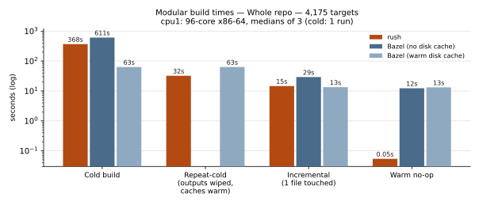

# Rush build status

Rush is an independent build engine for Bazel projects, written in Rust.
No JVM, no Bazel code. It consumes unmodified Bazel trees — BUILD files,
`.bzl` macros, Bzlmod module graphs, toolchains — and executes them with
Bazel-parity semantics: same artifacts, same select() behavior, same test
outcomes. The bar we hold ourselves to is byte parity: where we claim
support, rush's outputs hash-match Bazel's.

This repository tracks public progress and statistics for the project.
**The rush source is not yet public.** We are working toward an
open-source release and are looking for interested parties to collaborate
on a polished first release — build-system engineers, and maintainers of
large Bazel codebases who want a fast second implementation or a
conformance probe for their rule stacks. Open an issue here or contact
Luis Chamberlain <mcgrof@do-not-panic.com>.

## Headline results

| Workload | Result |
|----------|--------|
| TensorFlow 2.15 (unmodified) | Builds; **463/463** CPU `tf_cc_test` targets pass |
| `libtensorflow_cc.so` | Links, dlopen-loadable (`RTLD_NOW`), runs real workloads |
| TensorFlow GPU (ROCm, TF 2.17) | GPU `tf_cc_test` builds and passes on an AMD Radeon Pro W7900 |
| Modular whole-repo (pin 2026-07-30) | **4,175 of 4,175 (100%)** Bazel-buildable targets build under rush, incl. 1,063 real Python builds; 38/39 comparable `.mojoc` artifacts byte-identical |
| Modular pip lock pipeline | `uv lock` + wheel install + hermetic py_binary generator: output **byte-identical** to the checked-in 32,586-line lock file |
| Modular stdlib (pin 2026-08-04) | `std.mojoc` **byte-identical** to Bazel; 335/335 test targets build; **264 tests verified green** |
| Modular GPU (H100) | tiled_matmul builds, runs, validates; output byte-identical to Bazel over 10 alternating runs |
| Warm no-op, 335-target corpus | rush **0.02 s** vs Bazel 0.33 s |
| Single-file incremental, 335-target stdlib-test closure | rush **2.0 s** vs Bazel 4.7 s (small closure; see benchmarks.md for the whole-repo case, where Bazel's early cutoff currently wins) |

Honesty notes: at TensorFlow scale (18–21k targets) rush's warm no-op is
still slower than Bazel's; the daemon architecture that produces the
0.02 s number above is new and being proven upward. Detailed gap lists
live in the status pages — we publish what does not work yet with the
same care as what does.

## Build-time benchmarks

Whole-repo Modular tree, 96 cores: cold compile **rush 362 s vs Bazel
611 s**; repeat-cold from cache (outputs wiped) **32 s vs 63 s**;
single-file incremental **14.6 s vs 29 s** (content-based early cutoff);
warm no-op **0.05 s vs 12.6 s**. Methodology and the stdlib-scale chart
are in [benchmarks.md](benchmarks.md), together with the **H100 GPU
runtime correctness result: zero divergences** — every comparable
Bazel-green GPU kernel test also passes when built by rush.

## Status pages

- [Modular](status/modular.md) — Bzlmod + `rules_mojo` + Mojo stdlib corpus
- [TensorFlow](status/tensorflow.md) — the flagship C++ workload

## Methodology

- **No stubs.** Every supported rule executes real toolchains and produces
  real artifacts. Placeholder implementations are rejected in review and by
  pre-commit hooks.
- **Byte parity over green checkmarks.** Artifact hashes are compared
  against Bazel's outputs on the same tree and configuration.
- **Unmodified upstream sources.** Snags are rush bugs (fixed in rush) or
  upstreamable fixes to the target project — never local hack patches.
- **Receipts.** Every commit carries an AI-collaboration receipt block
  (agent, session, token accounting) under the MACP convention.
