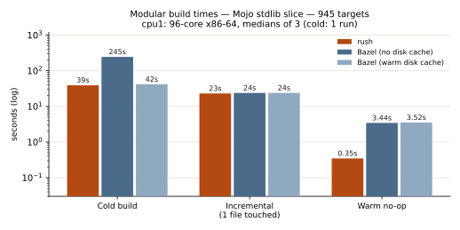
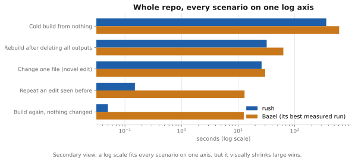

# Build-time benchmarks — Modular tree

Host: 96-core x86-64 (dual-socket Sapphire-Rapids class, 2 TB DDR +
512 GiB CXL), Modular pin `cc7155d`, both engines building the identical
label set with all external repositories pre-fetched. Values are medians
of 3 runs (cold: single run). "Bazel (warm disk cache)" is Bazel with the
tree's configured `--disk_cache` already populated — the best case Bazel
ever sees; "no disk cache" is a true cold compile, matching what rush
does. **Correction (2026-08-22):** the harness intended to clear rush's
disk cache before a cold run, but cleared `$WORKSPACE/.cache/rush`,
which holds no cache entries — the action cache and CAS live in
`$HOME/.cache/rush`. For the cold numbers below this did not change the
result (with the output tree wiped and no content-addressed store yet in
existence, a warm action cache could not skip any work), but re-running
that harness today would restore from the CAS and report a repeat-cold
time labelled "cold". The cold rows are being re-measured with the
correct path cleared.

Each panel above carries its own linear scale. A single shared axis
cannot show a 0.05 s no-op beside a 611 s cold build, and a single log
axis shrinks a 252x difference to a couple of centimetres. The log view
below is kept as a secondary index of the whole range.

Whole repo on one log axis (secondary view)

Regenerate all three with `python3 tools/make_graphs.py`; the numbers
live at the top of that script beside the table below.

| Scenario (whole repo, 4,175 targets) | rush | Bazel (no disk cache) | Bazel (warm disk cache) |
|---|---:|---:|---:|
| Cold build | **362 s** | 611 s | — |
| Repeat-cold (outputs wiped, caches warm) | **32 s** | — | 63 s |
| Warm no-op | **0.05 s** | 12.6 s | 13.2 s |
| Change one file (novel edit) | **26.0 s** | 30.1 s | — |
| Repeat an edit seen before | **0.15 s** | — | ~13 s |

| Scenario (stdlib slice, 945 targets) | rush | Bazel (no disk cache) | Bazel (warm disk cache) |
|---|---:|---:|---:|
| Cold build | **39 s** | 245 s | 42 s |
| Warm no-op | **0.35 s** | 3.4 s | 3.5 s |
| Incremental (1 file touched) | 23 s | 24 s | 24 s |

Reading the table honestly:

- **Cold compiles: rush is 1.7× faster whole-repo and 6× faster on the
  stdlib slice** than a true-cold Bazel. Rush's parallel wavefront drives
  all 96 cores with no JVM, no aspect overhead, and no sandbox setup tax.
- **Warm no-op: rush is ~250× faster** (0.05 s vs ~13 s). The rushd
  daemon's inotify dirty-set answers "nothing changed" without scanning.
- **Correction (2026-08-26): the previously published "Incremental
  14.6 s" was a cache-hit measurement, not an incremental build.** The
  old harness appended the same comment text on every run, so runs 2-3
  of the median-of-3 replayed run 1's compile from the action cache and
  the median reported the hit path. Measured honestly - fresh comment
  text per run, so no run can hit an earlier run's cache - a novel
  one-file edit cost 31.3 s when this correction was first published
  (31.6 s on the engine that published 14.6 s - the number was a
  protocol artifact, not a regression). Bazel pays 30.1 s for the
  identical edit. Both engines spend ~23 s of that in the one real
  compile (`std`). Profiling the remaining rush overhead found every
  action re-hashing every declared input file on every build - the Mojo
  toolchain's 0.3 GB alone was re-read 889 times per incremental - and
  a process-wide digest memo now hashes each distinct file once,
  revalidated by stat. Measured on the same protocol, three fresh-text
  runs, the serving daemon's binary identity asserted by inode:
  **26.0 s median**, ahead of Bazel by 4 s. Upgrading to the memoized
  key format costs one full rebuild per tree, once.
- **Repeating an edit rush has seen before costs 0.15 s.** Content-based
  early cutoff stamps every artifact with its value (a versioned BLAKE3
  fingerprint), so restoring bytes the ledger has already certified -
  reverting a change, toggling between two states, replaying a rebase -
  short-circuits in the daemon without re-running anything. Bazel
  re-analyzes and re-checks its cache for the same scenario: ~13 s.
  The old table compared these hit paths (14.6 s vs 13 s) while calling
  them "incremental"; both cells were repeat-edit numbers.
- **Repeat-cold: rush now has a real CAS.** Action results record full
  output records (fingerprints, content digests, modes, symlinks, tree
  structure) and output bytes live in a content-addressed store; deleting
  the entire output tree and rebuilding restores from cache in **32 s**
  versus Bazel's 63 s. Every restored
  blob is digest-verified during the copy — corrupt or truncated cache
  content becomes a miss, never a wrong build. Storing into the CAS costs
  nothing measurable on cold builds (362 s vs the 368 s pre-CAS baseline).
- **Virtual artifacts (behind a flag) do not change these numbers, and
  that is the honest result.** The next step after a CAS is to stop
  writing bytes nobody reads: when a cached action's outputs are absent,
  rush can publish only their value stamps and keep the content
  CAS-backed, materializing it when something actually opens it. It
  works — a whole-repo rebuild turns 1,357 cache restores into 1,357
  virtual hits and leaves 23% less on disk (6.34 GB → 4.88 GB), and a
  single-target build writes 531 KB instead of 16.4 MB — but on this
  host skipping 1.4 GB of restores buys no wall-clock time (the machine
  has 2.5 TB of RAM, so those writes plausibly never reach the device;
  that is inference, not a measurement). It is groundwork for remote
  caching, where the same bytes would otherwise cross a network.

## GPU runtime correctness (H100)

Runtime parity was validated on a rented H100 (PCIe): the GPU kernel
test corpus was cross-compiled for `sm_90a` on the build host by BOTH
engines, and the binaries executed on the GPU with the repo's own
FileCheck / expect-crash semantics.

- Corpus: 287 GPU kernel tests (of 763; the remainder are multi-hour,
  100 GB+ RSS compile outliers — two of them OOM-killed under Bazel
  itself on a 2.5 TB machine).
- **Zero runtime divergences: every comparable Bazel-green test (222 of
  222) also passes when built by rush.** 12 shared failures agree
  between engines (H100-PCIe environment specifics). Rush's binaries
  additionally pass 36 tests where Bazel's filecheck wrapper scripts
  cannot run outside `bazel test` runfiles.
- Mojo GPU programs built by rush are byte-parity-class artifacts: the
  earlier H100 receipt showed byte-identical run output over ten
  alternating Bazel/rush runs.
